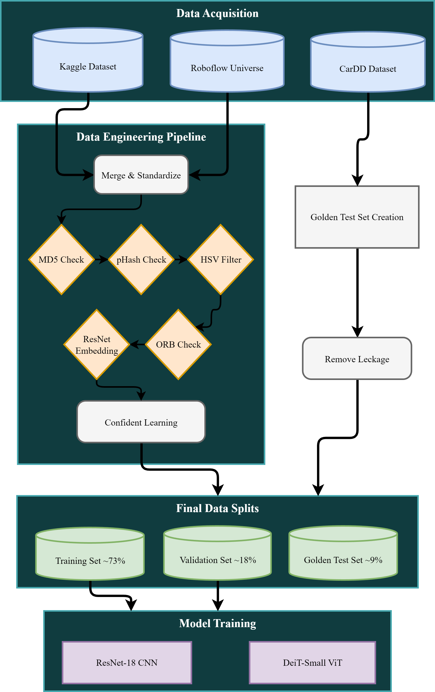
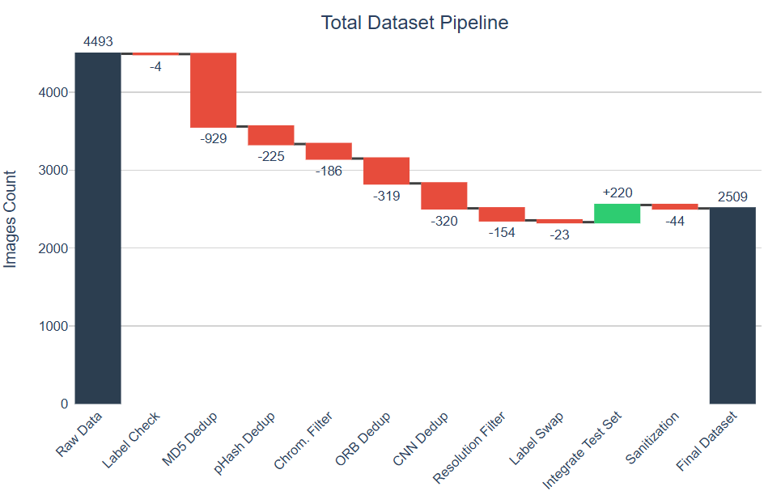

# 🚗 Vehicle Damage Severity Dataset (VDS-2.5k)

**A curated, balanced, and cleaned dataset for automated vehicle damage assessment.**

This repository contains the final dataset used in the Bachelor's Thesis *"Data-driven Deep Learning for Automated Vehicle Damage Severity Assessment"*.
Unlike raw web-scraped collections, this dataset has undergone a rigorous forensic data engineering pipeline to eliminate duplicates, fix label noise, and standardize inputs.

---

## 🎯 The "Data-Centric" Philosophy

Most car damage datasets available online suffer from:
* **Massive Duplication:** The same car appearing in "Train" and "Test" splits (Data Leakage).
* **Label Noise:** The same image labeled as "Minor" in one place and "Moderate" in another.
* **Hidden Augmentations:** Pre-rotated or color-jittered copies that inflate dataset size without adding value.

**This project fixes that.** instead of chasing complex models, I focused on engineering the data. The result is a high-quality corpus that allows even simple models (like ResNet-18 or DeiT-Small) to achieve superior performance.

---

## 🏗️ Data Engineering Pipeline

I consolidated three heterogeneous sources and filtered them through a 5-stage cleaning pipeline.

*(Figure: Overview of the Data-Centric Methodology Pipeline)*

### Sources
1.  [**Kaggle Dataset**](https://www.kaggle.com/datasets/prajwalbhamere/car-damage-severity-dataset)
2.  [**Roboflow Universe**](https://universe.roboflow.com/igrmus/damage-severity-6ya6c-dnc4x)
3.  [**CarDD**](https://github.com/CarDD-USTC/CarDD-USTC.github.io) (Wang et al., 2022) - *Used exclusively for the Golden Test Set*

### The Cleaning Process
From an initial pool of **~4,713 images**, I removed ~47% of the data to reach the highest quality standard:

1.  **Standardization:** Global renaming to `source_split_class_id.jpg`.
2.  **Exact Deduplication (MD5):** Removed binary duplicates within and across datasets.
3.  **Perceptual Deduplication (pHash):** Removed near-duplicates and resized copies.
4.  **Semantic Deduplication (ResNet Embeddings):** Used Deep Learning to find the same car photographed from slightly different angles.
5.  **Quality & Geometric Filter:** Removed low-res inputs (<200px) and grayscale images.
6.  **Label Noise Reduction:** Used **Confident Learning** to algorithmically identify and fix mislabeled samples (e.g., "Severe" labeled as "Minor").

*(Figure: Overview of the Data Cleaning Results)*

---

## 📊 Dataset Statistics

The final dataset consists of **2,509 images** divided into three severity classes.

| Class | Description | Train | Val | Test (Golden Set) | Total |
| :--- | :--- | :--- | :--- | :--- | :--- |
| **Minor** | Scratches, dents, paint damage. Repairable. | 722 | 180 | 91 | **993** |
| **Moderate** | Large dents, detached parts. Requires panel replacement. | 577 | 144 | 74 | **795** |
| **Severe** | Structural damage, airbags, total loss. | 533 | 133 | 55 | **721** |
| **Total** | | **1,832** | **457** | **220** | **2,509** |

> **Note:** The "Golden Test Set" (Test split) is sourced entirely from **CarDD**. It is visually distinct from the training data, ensuring a truly unbiased evaluation of real-world generalization.

---

## 🚀 Benchmarks & Performance

This dataset was used to train a **ResNet-18** (CNN) and **DeiT-Small** (Vision Transformer).

* **Best Single Model:** ResNet-18 with Photometric Augmentation (F1: 0.7370).
* **Best Ensemble:** ResNet + DeiT Weighted Ensemble (F1: **0.7761**).

The high performance on such a compact dataset confirms that **Data Quality > Data Quantity**.

---

## 📂 Usage

You can download the dataset directly from this repository.
